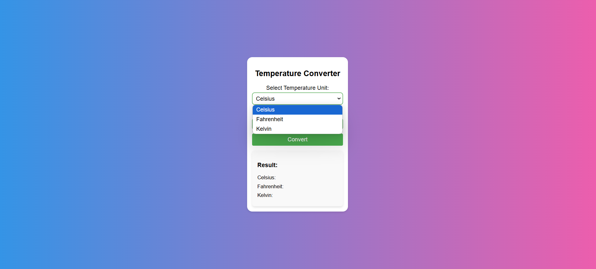

# Temperature Converter

## Overview
The Temperature Converter is a simple web application that allows users to convert temperatures between Celsius, Fahrenheit, and Kelvin. The application provides an intuitive interface for inputting temperature values and viewing the converted results.

## Features
- Input temperature in Celsius, Fahrenheit, or Kelvin.
- Displays converted temperatures in all three units (Celsius, Fahrenheit, Kelvin).
- User-friendly interface with clear and readable design.
- Real-time conversion and feedback on input values.

## Technologies Used
- HTML
- CSS
- JavaScript

## How to Use
1. Open the `index.html` file in your web browser.
2. Use the dropdown to select the temperature unit you want to convert from.
3. Enter the temperature value in the input field.
4. Click the "Convert" button to see the results.

## How it works
1. **Select Temperature Unit**: Choose a unit from the dropdown (Celsius, Fahrenheit, Kelvin).
2. **Input Value**: Enter a numeric temperature value.
3. **Convert**: Click the "Convert" button.
4. **Result**: The converted temperatures will display below the "Result" section.

## Example Screenshot:  
1. **User Interface with Input Section and Dropdown**  
     
   Explanation: In this screenshot, the user selects the "Celsius" option from the dropdown and inputs a temperature value (e.g., 50). The results show conversion into Fahrenheit and Kelvin below.

2. **Conversion Results Section**  
     
   Explanation: After clicking the "Convert" button, the converted temperatures appear in all three units (Celsius, Fahrenheit, Kelvin) below, displayed in a neatly formatted results box.

## Features to Add
- Support for additional temperature units such as Rankine.
- More advanced input validation to handle edge cases.
- Enhanced UI/UX with animations or interactive elements.

## Customization
Users can customize the appearance of the converter by modifying the CSS file (`style.css`) to adjust colors, font sizes, and layout styles to better suit their preferences.

## Contribution
1. Fork the repository.
2. Create a new branch (`git checkout -b feature-branch`).
3. Commit your changes (`git commit -m 'Add some feature'`).
4. Push to the branch (`git push origin feature-branch`).
5. Open a pull request.
-----
Feel free to contribute to this project. Any issues, suggestions, or improvements are welcome!
